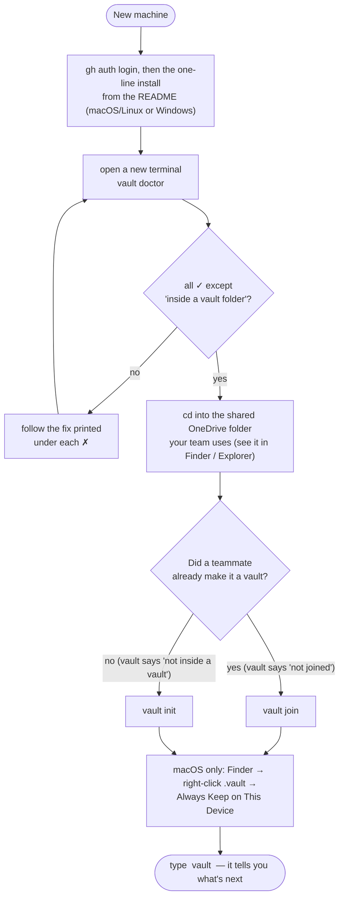
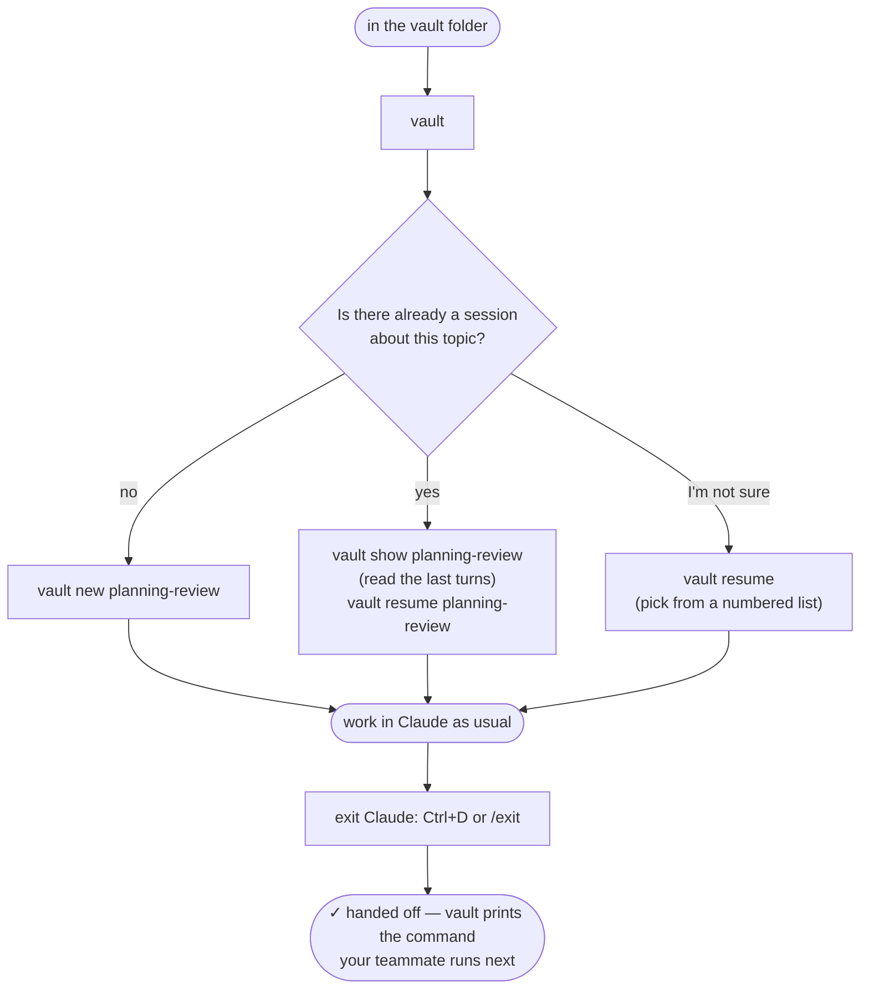
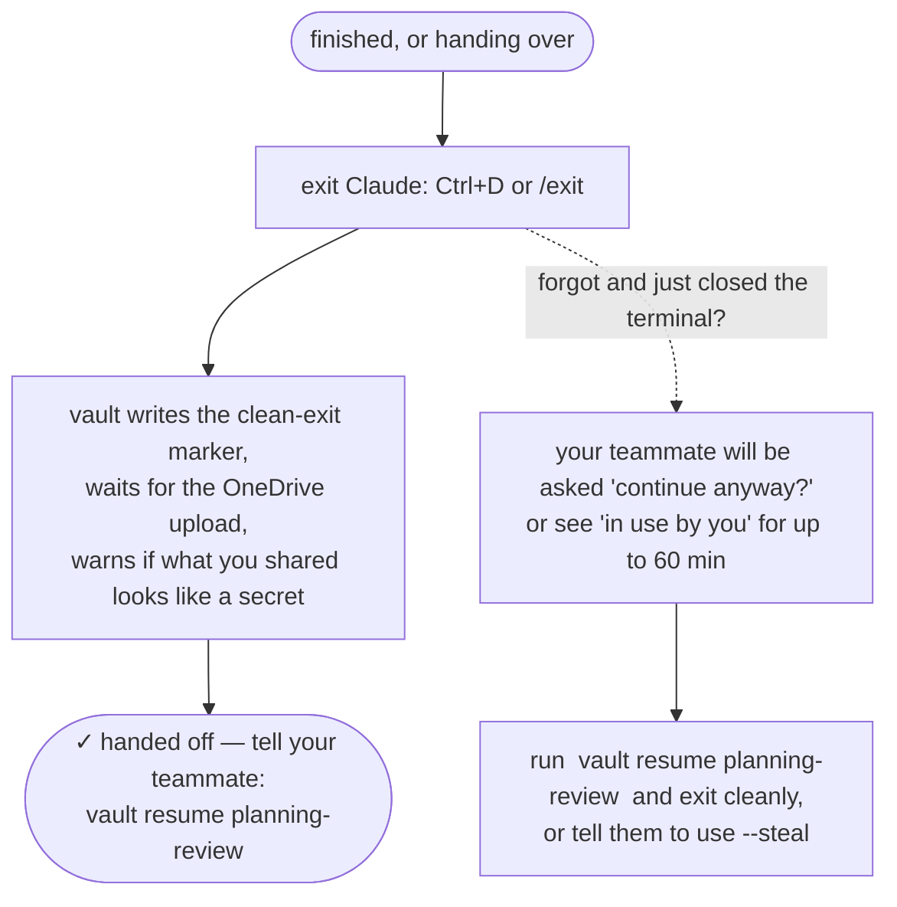
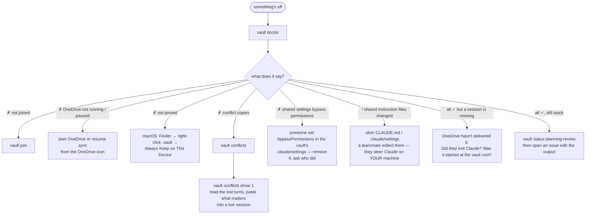
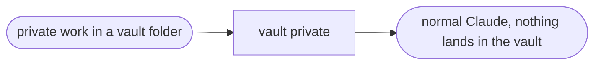

# vault — shared Claude Code sessions in a shared folder

Normally a Claude Code conversation belongs to *you*: it lives in your home folder and
nobody else can see it or continue it. A **vault** flips that. Conversations belong to a
**shared OneDrive folder**. Anyone who joins the vault sees the same sessions, can pick
up a conversation a teammate started with all of its context, and can hand it back.

```
  you ──── vault new planning-review ────┐
                                         ▼
                        📁 shared OneDrive folder  ← the conversation lives here
                                         ▲
  teammate ── vault resume planning-review ┘      ← continues exactly where you stopped
```

Sessions have **names**. You hand off `planning-review`, not `98c2c061-24a5-…`.
Works on **macOS and Windows** (Linux builds exist; no OneDrive client there).

> **Private beta.** This repo is private; ask Shash for access. Claude Code has no
> first-party way for one person to continue another person's session
> ([why vault exists](docs/remote-control-evaluation.md)).
> Journal and history: [oxmiq/capsule#1559](https://github.com/oxmiq/capsule/issues/1559).

---

## Install (2 minutes, once per machine)

You need: [Claude Code](https://code.claude.com) installed and logged in
(`claude --version` prints a version), and the [GitHub CLI](https://cli.github.com)
logged in (`gh auth status`), because the repo is private.

**macOS / Linux**

```bash
gh api repos/shashb27/vault/contents/install.sh -H "Accept: application/vnd.github.raw" | bash
```

**Windows** (PowerShell)

```powershell
gh api repos/shashb27/vault/contents/install.ps1 -H "Accept: application/vnd.github.raw" | Out-String | iex
```

(The repo is private, so plain `curl` to a raw URL gets a 404; `gh api` uses your login.)

Open a new terminal, then:

```bash
vault doctor
```

Every line should be a ✓ except "inside a vault folder", which you fix next.
Later, `vault update` installs the newest release.

## Start using it (5 minutes)

**If your team already has a vault** (a teammate made one), go to the folder you both
see in OneDrive and join:

```bash
cd ~/Library/CloudStorage/OneDrive-…/TheSharedFolder      # macOS
cd "$env:OneDriveCommercial\TheSharedFolder"                # Windows
vault join
```

**If you are the first person**, pick a folder in a SharePoint/OneDrive library that
your teammates also sync, and:

```bash
vault init
```

`init` creates the vault and joins you. Both run a quick self-check (one silent Claude
call) that proves Claude really writes into the shared folder. On Windows the `.vault`
folder is pinned automatically; on macOS you do it once in Finder: right-click the hidden
`.vault` folder → **Always Keep on This Device** (`Cmd+Shift+.` shows hidden folders).

Then, at any time, just type:

```bash
vault
```

It tells you where you are, what sessions exist, who is in them, and what to do next.

## Which situation are you in?

Find yours, follow the arrows. Every box is a real command or something you'll see on screen.

### A. "I'm new here and want to set up"



### B. "I want to start working on something"



### C. "A teammate handed me a session"


### D. "I'm done for now"



### E. "Something looks wrong"



### F. "I want Claude in this folder, but NOT shared"



## Everyday use

| You want to… | Run |
|---|---|
| Start a conversation the team can pick up | `vault new planning-review` |
| See what's there and who touched what | `vault` or `vault sessions` |
| Read the last turns before jumping in | `vault show planning-review` |
| Continue a teammate's conversation | `vault resume planning-review` |
| Continue one, choosing from a list | `vault resume` |
| Give a session a better name | `vault rename planning-review q4-plan` |
| Get a finished session out of the list | `vault archive planning-review` (`vault restore` brings it back) |
| See who has joined | `vault members` |
| Check the setup | `vault doctor` |
| Work in this folder **without** sharing | `vault private` |

Inside Claude everything is normal. When you're done, **exit Claude** (`Ctrl+D` or
`/exit`). That's the handoff: vault marks the session as finished, waits for OneDrive to
upload it, warns if what you just shared looks like an API key or private key, and prints
the exact command your teammate runs next.

`vault resume` does the waiting for you: if the transcript is still syncing, or the
previous person hasn't exited yet, it waits and tells you why. It never silently continues
from a half-synced conversation.

**One rule: one person in a session at a time.** If two people type into the same session
at once, OneDrive keeps two copies and the second person's turns end up in a "conflict
copy" instead of the shared conversation. `vault` warns you when someone is in a session,
and `vault conflicts` shows you what was lost if it happens anyway.

## Read once: what "shared" means

- **Everything Claude reads or prints in a vault session is shared** with every member,
  including files from outside the vault, command output, and personal connectors
  (mail, calendar). Don't `cat` secrets in a vault session.
- **Members can steer each other's Claude.** `CLAUDE.md`, `.claude/settings*.json` and
  Claude's project memory in the vault folder are shared and editable by everyone, and
  they apply on *your* machine. `vault` warns when they change, and refuses to start if
  they turn off permission prompts. Never click "don't ask again" inside a vault, and only
  vault with people you'd trust to run commands on your machine.
- **Leaving doesn't un-share.** What you shared stays on teammates' machines and in
  OneDrive version history.
- **The conversation is shared; the workbench is not.** `/rewind` checkpoints,
  background tasks, prompt history and your permission grants stay on your own machine.
- Your **login is never shared**; it stays in your OS keychain / credential store.

Full trust model: [docs/safety.md](docs/safety.md).

## More

- [docs/handoff.md](docs/handoff.md) — the two-person handoff, step by step, with what you'll see (the long form of chart C)
- [docs/troubleshooting.md](docs/troubleshooting.md) — symptoms → causes → fixes
- [docs/safety.md](docs/safety.md) — trust model, what leaks, what doesn't
- [docs/remote-control-evaluation.md](docs/remote-control-evaluation.md) — why Claude Code's own multi-device features don't replace this
- [docs/ARCHITECTURE.md](docs/ARCHITECTURE.md) — how the binary is built, platform layer, Windows plan
- [docs/DESIGN.md](docs/DESIGN.md) — the original design: symlinked project dir, leases, sync gates
- [docs/TEST-EVIDENCE.md](docs/TEST-EVIDENCE.md) — verification rounds
- [tests/windows-checklist.md](tests/windows-checklist.md) — what still has to be checked on a real Windows machine
- [CHANGELOG.md](CHANGELOG.md)

Bugs and ideas: [open an issue](https://github.com/shashb27/vault/issues).

## For developers

```bash
git clone https://github.com/shashb27/vault ~/code/vault && cd ~/code/vault
go build -o dist/vault ./cmd/vault      # needs Go 1.27+
go test ./...                           # unit tests: encoding, resolve, transcripts, leases, secrets
tests/sim.sh                            # two simulated users, real Claude calls, 65 checks, ~5 min
VAULT_LOCAL=dist/vault ./install.sh     # install your build
./build.sh 0.3.0                        # cross-compile every platform into dist/
```

One binary, no runtime. All transcript parsing is in `internal/vault/transcript.go`, the
one place to fix when Claude Code's internal format changes. `legacy/vault.sh` is the
v0.2.1 bash implementation kept as the behavioural reference; the same `tests/sim.sh`
passes against both (`VAULT_BIN=legacy/vault.sh tests/sim.sh`). The `.vault/` layout is
unchanged since v0.1, so old and new clients can share a vault. Tagging `vX.Y.Z` builds a
GitHub release with binaries for every platform.
