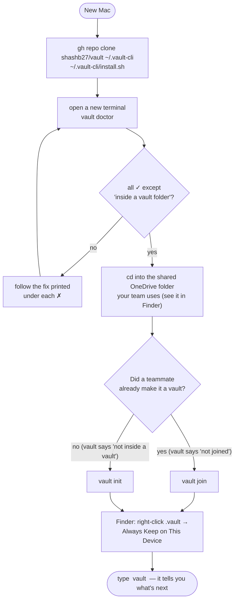
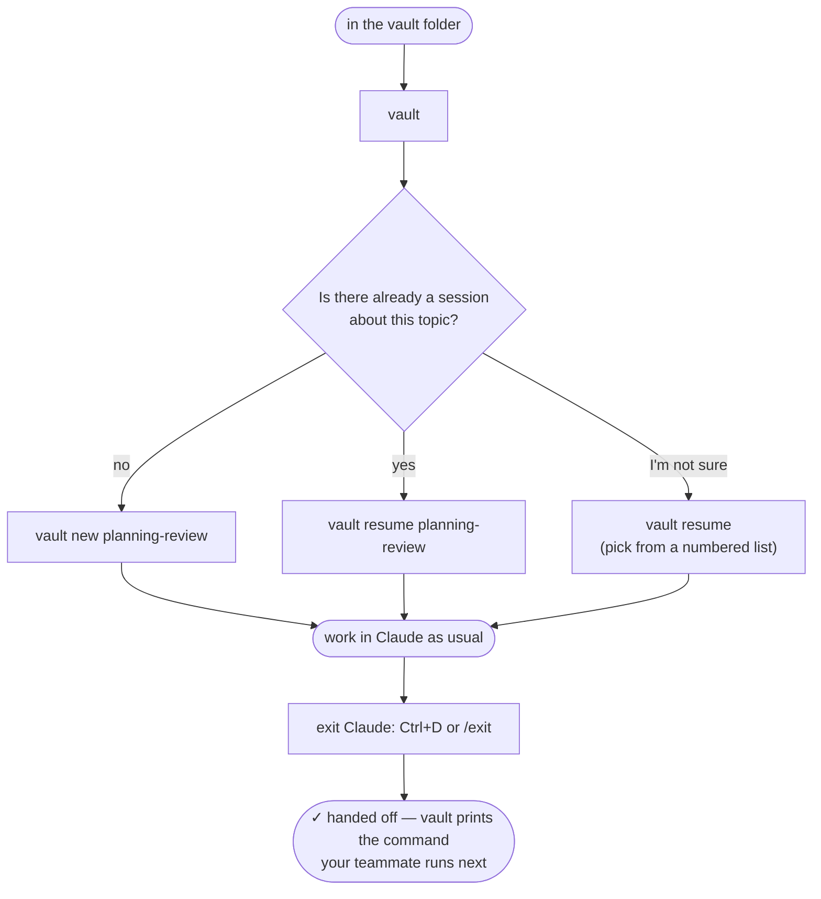
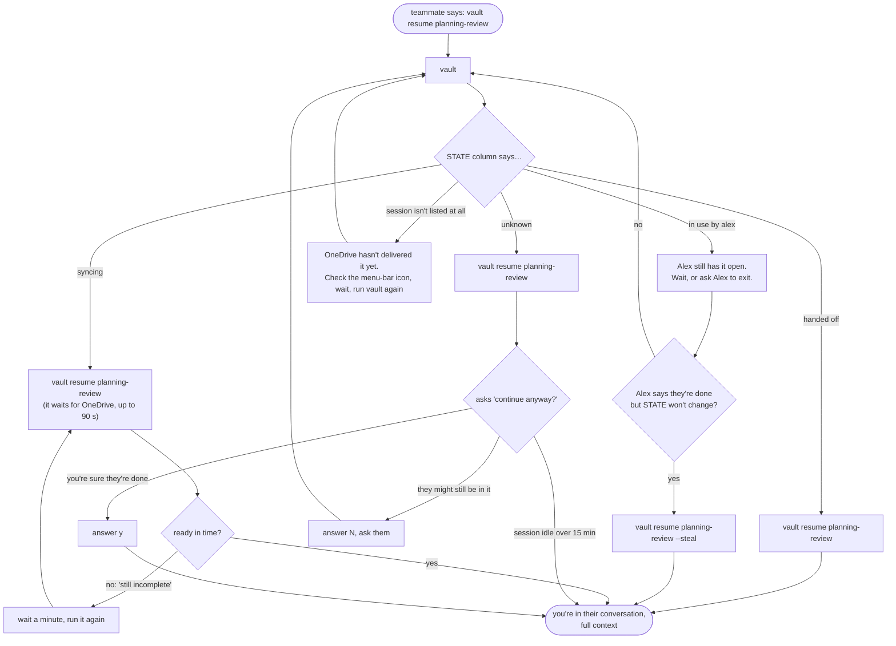
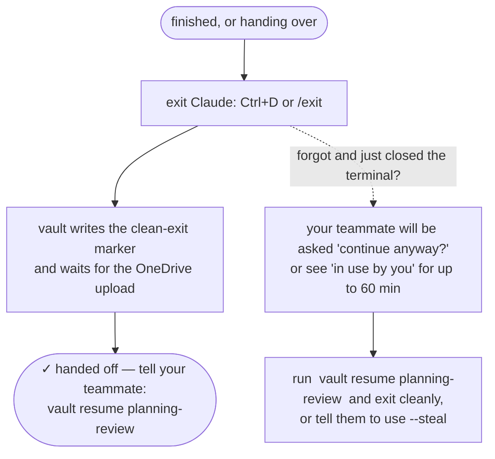
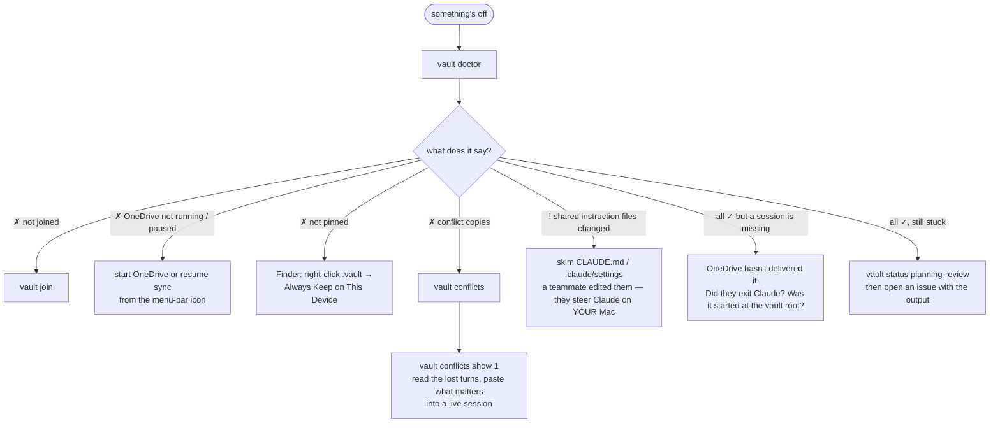

# vault — shared Claude Code sessions in a shared folder

Normally a Claude Code conversation belongs to *you*: it lives in your home folder and
nobody else can see it or continue it. A **vault** flips that. Conversations belong to a
**shared OneDrive folder**. Anyone who joins the vault sees the same sessions, can pick
up a conversation a teammate started with all of its context, and can hand it back.

```
  you ──── vault new planning-review ────┐
                                         ▼
                        📁 shared OneDrive folder  ← the conversation lives here
                                         ▲
  teammate ── vault resume planning-review ┘      ← continues exactly where you stopped
```

Sessions have **names**. You hand off `planning-review`, not `98c2c061-24a5-…`.

> **Private beta.** This repo is private; ask Shash for access. macOS only.
> Journal and history: [oxmiq/capsule#1559](https://github.com/oxmiq/capsule/issues/1559).

---

## Install (2 minutes, once per Mac)

You need: a Mac, [Claude Code](https://code.claude.com) installed and logged in
(`claude --version` prints a version), and the GitHub CLI logged in (`gh auth status`).

```bash
gh repo clone shashb27/vault ~/.vault-cli && ~/.vault-cli/install.sh
```

Open a new terminal, then:

```bash
vault doctor
```

Every line should be a ✓ except "inside a vault folder", which you fix next.
Later, `vault update` pulls the newest version.

## Start using it (5 minutes)

**If your team already has a vault** (a teammate made one):

```bash
cd ~/Library/CloudStorage/OneDrive-…/TheSharedFolder     # the folder you both see in Finder
vault join
```

**If you are the first person**, pick a folder in a SharePoint/OneDrive library that
your teammates also sync, and:

```bash
cd ~/Library/CloudStorage/OneDrive-…/TheSharedFolder
vault init
```

`init` creates the vault and joins you. Both commands run a quick self-check (one silent
Claude call) and tell you the one manual step OneDrive needs: in Finder, right-click the
hidden `.vault` folder → **Always Keep on This Device** (press `Cmd+Shift+.` to show
hidden folders).

Then, at any time, just type:

```bash
vault
```

It tells you where you are, what sessions exist, who is in them, and what to do next.

## Which situation are you in?

Find yours, follow the arrows. Every box is a real command or something you'll see on screen.

### A. "I'm new here and want to set up"



### B. "I want to start working on something"



### C. "A teammate handed me a session"



### D. "I'm done for now"



### E. "Something looks wrong"



### F. "I want Claude in this folder, but NOT shared"


## Everyday use

| You want to… | Run |
|---|---|
| Start a conversation the team can pick up | `vault new planning-review` |
| See what's there and who touched what | `vault` or `vault sessions` |
| Continue a teammate's conversation | `vault resume planning-review` |
| Continue one, choosing from a list | `vault resume` |
| Give a session a better name | `vault rename planning-review q4-plan` |
| Check the setup | `vault doctor` |
| Work in this folder **without** sharing | `vault private` |

Inside Claude everything is normal. When you're done, **exit Claude** (`Ctrl+D` or
`/exit`). That's the handoff: vault marks the session as finished, waits for OneDrive to
upload it, and prints the exact command your teammate runs next.

`vault resume` does the waiting for you: if the transcript is still syncing, or the
previous person hasn't exited yet, it waits and tells you why. It never silently continues
from a half-synced conversation.

**One rule: one person in a session at a time.** If two people type into the same session
at once, OneDrive keeps two copies and the second person's turns end up in a "conflict
copy" instead of the shared conversation. `vault` warns you when someone is in a session,
and `vault conflicts` shows you what was lost if it happens anyway.

## Read once: what "shared" means

- **Everything Claude reads or prints in a vault session is shared** with every member,
  including files from outside the vault, command output, and personal connectors
  (mail, calendar). Don't `cat` secrets in a vault session.
- **Members can steer each other's Claude.** `CLAUDE.md`, `.claude/settings*.json` and
  Claude's project memory in the vault folder are shared and editable by everyone, and
  they apply on *your* Mac. `vault` warns when they change. Never click "don't ask
  again" inside a vault, and only vault with people you'd trust to run commands on your
  machine.
- **Leaving doesn't un-share.** What you shared stays on teammates' Macs and in OneDrive
  version history.
- **The conversation is shared; the workbench is not.** `/rewind` checkpoints,
  background tasks, prompt history and your permission grants stay on your own Mac.
- Your **login is never shared**; it stays in your macOS Keychain.

Full trust model: [docs/safety.md](docs/safety.md).

## More

- [docs/handoff.md](docs/handoff.md) — the two-person handoff, step by step, with what you'll see (the long form of chart C)
- [docs/troubleshooting.md](docs/troubleshooting.md) — symptoms → causes → fixes
- [docs/safety.md](docs/safety.md) — trust model, what leaks, what doesn't
- [docs/DESIGN.md](docs/DESIGN.md) — how it works (symlinked project dir, leases, sync gates)
- [docs/TEST-EVIDENCE.md](docs/TEST-EVIDENCE.md) — verification rounds
- [CHANGELOG.md](CHANGELOG.md)

Bugs and ideas: [open an issue](https://github.com/shashb27/vault/issues).

## For developers

```bash
git clone https://github.com/shashb27/vault ~/code/vault
cd ~/code/vault && ./install.sh      # links ~/.local/bin/vault to this checkout
tests/sim.sh                         # two simulated users, real Claude calls, ~3 min
```

`vault.sh` is one bash file; all transcript parsing is in the embedded Python block near
the top (`vpy`). `.vault/` layout is unchanged from v0.1, so old and new clients can share
a vault.
