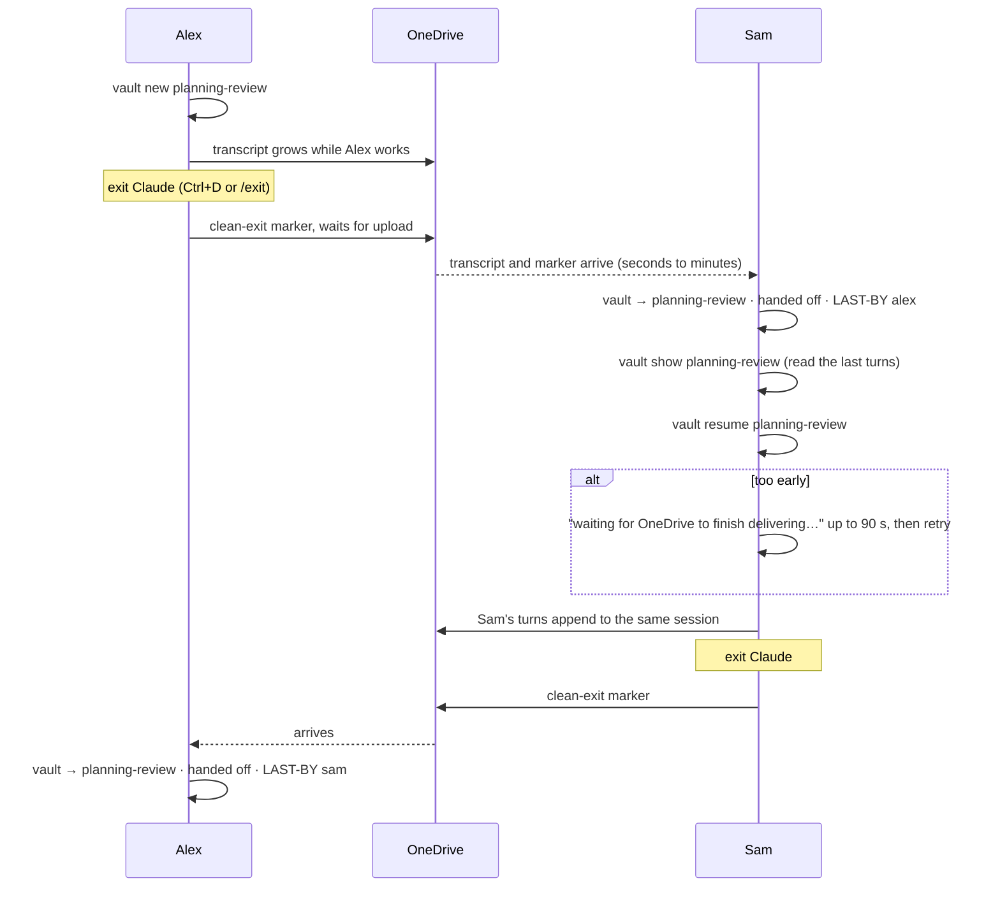

# vault — shared Claude Code sessions in a shared folder

Normally a Claude Code conversation belongs to *you*: it lives in your home folder and
nobody else can see it or continue it. A **vault** flips that. Conversations belong to a
**shared OneDrive folder**. Anyone who joins the vault sees the same sessions, can pick
up a conversation a teammate started with all of its context, and can hand it back.

```
  you ──── vault new planning-review ────┐
                                         ▼
                        📁 shared OneDrive folder  ← the conversation lives here
                                         ▲
  teammate ── vault resume planning-review ┘      ← continues exactly where you stopped
```

Sessions have **names**. You hand off `planning-review`, not `98c2c061-24a5-…`.
Works on **macOS and Windows** (Linux builds exist; no OneDrive client there).

> **Beta.** Claude Code has no
> first-party way for one person to continue another person's session
> ([why vault exists](docs/remote-control-evaluation.md)).
> Journal and history: [oxmiq/capsule#1559](https://github.com/oxmiq/capsule/issues/1559).

---

## Install (2 minutes, once per machine)

You need [Claude Code](https://code.claude.com) installed and logged in
(`claude --version` prints a version). Nothing else.

**macOS / Linux**

```bash
curl -fsSL https://github.com/shashb27/vault/releases/latest/download/install.sh | bash
```

**Windows** (PowerShell)

```powershell
irm https://github.com/shashb27/vault/releases/latest/download/install.ps1 | iex
```

Open a new terminal, then:

```bash
vault doctor
```

Every line should be a ✓ except "inside a vault folder", which you fix next.
Later, `vault update` installs the newest release.

## Step 0: the shared folder (one person, once)

A vault is just a folder that OneDrive syncs to everyone's machine. You need that folder
before anything else. Two questions decide what to do:

**Do you already have one?** A folder that both of you can see inside your OneDrive
folder on your own machines:

- macOS: `~/Library/CloudStorage/OneDrive-<YourOrg>/` (Finder → OneDrive in the sidebar)
- Windows: `C:\Users\<you>\OneDrive - <Your Org>\` (Explorer → OneDrive)

If the same folder name shows up on both machines, you have one. Skip to "Start using it".

**If not, create one.** Either of the standard OneDrive ways works; menu wording can differ
slightly in your tenant:

- **From a Teams channel or SharePoint site the team already uses.** Open the channel's
  Files tab, create a folder (for example `claude-vault`), then click **Sync** or
  **Add shortcut to OneDrive**. Everyone else on the team does the same click. The folder
  then appears inside each person's OneDrive folder on their machine.
- **From your own OneDrive.** Create a folder in OneDrive, **Share** it with your teammates
  with edit access. Each teammate opens the link in OneDrive on the web and clicks
  **Add shortcut to My files**, so it syncs to their machine too.

Then each person checks the folder is really there in Finder or Explorer, with a green tick.
The vault does nothing until OneDrive has that folder on both machines.

**Which folder.** Use a dedicated folder for the vault (like `team-vault`), not a big
existing one: everything Claude does there is shared, and the vault's hidden `.vault/`
folder lives inside it.

## Start using it (5 minutes)

You are in the folder from Step 0. **If a teammate already ran `vault init` there**, join:

```bash
cd ~/Library/CloudStorage/OneDrive-…/TheSharedFolder      # macOS
cd "$env:OneDriveCommercial\TheSharedFolder"                # Windows
vault join
```

**If you are the first person**, make it a vault:

```bash
vault init
```

`init` creates the vault and joins you. Both run a quick self-check (one silent Claude
call) that proves Claude really writes into the shared folder. On Windows the `.vault`
folder is pinned automatically; on macOS you do it once in Finder: right-click the hidden
`.vault` folder → **Always Keep on This Device** (`Cmd+Shift+.` shows hidden folders).

Then, at any time, just type:

```bash
vault
```

It tells you where you are, what sessions exist, who is in them, and what to do next.

## Which situation are you in?

Four short cards for the linear cases, one picture for the handoff (the only part with
two people and timing), and a lookup table for everything the tool prints.

<details>
<summary><b>I'm new here and want to set up</b></summary>

1. Run the one-line install above. Open a new terminal.
2. `vault doctor` — fix anything with a ✗ (it prints the fix under each).
3. Make sure the team's shared folder is on your machine (Step 0 above). If the team has
   none yet, create it there first. Then `cd` into it.
4. Run `vault`. It says either **"not joined"** → run `vault join`, or **"not inside a vault"** → you're first, run `vault init`.
5. macOS only: in Finder, right-click the hidden `.vault` folder → **Always Keep on This Device**. Windows does this for you.
6. From now on, `vault` tells you what's there and what to do next.

</details>

<details>
<summary><b>I want to start working on something</b></summary>

1. `vault` — if a teammate handed you something, it opens with **Waiting for you**: the session, who, and their one-line note. Otherwise, is there already a session about this? Names are in the first column.
2. No → `vault new planning-review` (any name your teammates will recognise).
   Yes → `vault show planning-review` to read where it stopped, then `vault resume planning-review`.
   Not sure → `vault resume` with no name gives you a numbered list.
3. Work in Claude as usual.
4. Done for now → exit Claude (`Ctrl+D` or `/exit`). vault hands the session to the team and prints the command your teammate runs.

</details>

<details>
<summary><b>I'm done for now</b></summary>

1. Exit Claude with `Ctrl+D` or `/exit`. Don't just close the terminal.
2. vault asks for one line: `hand off planning-review — one line for the next person, '@name' to address it (Enter to skip)`. Type `@sam check the totals in section 3`. `@name` is a login or a machine name as `vault members` lists them, not a person; a prefix works when it points at exactly one member.
3. vault writes the clean-exit marker with your note, waits for OneDrive to upload, and warns if what you shared looks like an API key.
4. Sam's next `vault` opens with **Waiting for you** and the exact resume command. No side channel needed. Forgot the note? `vault note planning-review @sam "…"` adds it later.

Forgot and closed the window? Your teammate will be asked "continue anyway?" or see `in use by you` for up to an hour. Run `vault resume planning-review`, exit cleanly, or tell them to use `--steal`.

</details>

<details>
<summary><b>I want Claude in this folder, but NOT shared</b></summary>

`vault private` — normal Claude, nothing lands in the vault. Use this for anything personal or for `--dangerously-skip-permissions`, which vault refuses inside a shared session.

</details>

### The handoff, in one picture



One person in a session at a time. If both type at once, OneDrive keeps two copies and
vault moves the extra one to `vault conflicts`.

### What you see → what it means → what to do

Every line here is text vault actually prints. Find the one on your screen.

**In the session list (`vault`, `vault sessions`), STATE column**

| You see | It means | Do this |
|---|---|---|
| `handed off` | the last person exited cleanly | `vault resume <name>` — safe |
| `in use by alex` | Alex has it open right now | wait, or ask Alex to exit. `vault resume <name> --steal` only if you're sure they're done |
| `in use (you)` | you have it open in another terminal | go back to that terminal |
| `syncing` | the copy on your machine is incomplete | `vault resume <name>` waits for it, or just wait a minute |
| `unknown` | no clean-exit marker: started with plain `claude`, or the exit hasn't synced | `vault resume <name>` — it asks before continuing; idle over 15 min counts as finished |
| `(unnamed) 98c2c061` + a quoted first prompt | started without `vault new` | `vault rename 98c2c061 <name>` |
| `Waiting for you` block above the table | a teammate handed a session to you (by your login or machine name) | the `vault resume` line under it |
| `for sam: "check the totals"` under a row | the handoff note left for sam | if you're sam, resume; otherwise carry on with your own work |
| `! large session(s): …` | over 5 MB: slow to sync, heavy to resume | `/compact` inside Claude before handing off |

**When resuming**

| You see | It means | Do this |
|---|---|---|
| `waiting for OneDrive to finish delivering …` | transcript still arriving | wait; it retries for 90 s |
| `waiting for the previous person to exit …` | no clean-exit marker yet | wait; it retries for 90 s |
| `… is still incomplete on this machine (OneDrive mid-sync)` | gave up waiting | try again in a minute; `vault status <name>` shows progress |
| `… was last touched by alex and has no clean-exit marker yet` then `continue anyway? [y/N]` | Alex may still be in it | `N` and ask Alex, unless you're certain |
| `no clean-exit marker (started outside vault?) but idle for 25m — treating it as finished` | nobody holds it and it's been quiet | nothing; it continues |
| `alex@alex-mac is in this session right now` | Alex holds the lease | ask Alex to exit; `--steal` if they've crashed or forgotten |
| `… is working in this vault with an older vault version` | a teammate still runs v0.1/v0.2 | ask them to run the installer; `--steal` if you're sure they're done |
| `a session named 'x' already exists in this vault` | names are unique per vault | `vault resume x`, or pick another name |
| `'--dangerously-skip-permissions' is not allowed inside a vault` | bypassing prompts here would let any member run anything on your machine | `vault private` for that |
| `alex left a note for you: "…"` | the previous person addressed this handoff to you | read it; Claude sees it too, as information |
| `alex left a note for sam: "…" — carrying on` | the note was for someone else; nothing stops you | continue, or leave it for sam |
| `no member matches 'x'` | `@x` is not a login, host or login@host of any member, or the prefix fits two members | check `vault members`; use a longer prefix |

**Warnings that can appear on any command**

| You see | It means | Do this |
|---|---|---|
| `OneDrive is not running` | nothing propagates | start OneDrive |
| `OneDrive sync is PAUSED` | nothing propagates | resume sync from the OneDrive icon |
| `two people were in one session at the same time` | a conflict copy was quarantined; its turns are not in the main session | `vault conflicts`, then `vault conflicts show 1` to read and paste back what matters |
| `shared instruction/permission files changed since your last run` | a teammate edited `CLAUDE.md` or `.claude/settings` in the vault; they steer Claude on **your** machine | skim them before working |
| `this vault already has shared instruction/permission files you have never reviewed` | same, first time you join | read them now |
| `shared memory has a conflict copy` | two members' Claude wrote memory at once | merge by hand in `.vault/sessions/memory/` |
| `refusing to start: … sets defaultMode to bypassPermissions` | shared settings turn off permission prompts | remove the line, ask who added it |
| `what was just shared looks like it contains a secret` | a key-shaped string went into the shared transcript | rotate it if real |
| `(no shared session was changed in this run)` | you exited without typing anything | nothing |

**From `vault doctor`**

| You see | Do this |
|---|---|
| `✗ Claude Code installed` | install Claude Code, run `claude` once to log in |
| `✗ GitHub CLI (gh) available` | install from cli.github.com, `gh auth login` |
| `✗ inside a vault folder` | `cd` into the shared folder, then `vault init` or `vault join` |
| `✗ not joined` | `vault join` |
| `✗ OneDrive running` / `✗ OneDrive sync not paused` | start OneDrive / resume sync |
| `✗ vault folder pinned (always keep on this device)` | macOS: Finder → right-click `.vault` → Always Keep on This Device |
| `✗ no conflict copies (3)` | `vault conflicts` |
| `✗ shared settings do not bypass permissions` | remove `bypassPermissions` from the vault's `.claude/settings`, ask who added it |

**When joining**

| You see | Do this |
|---|---|
| `this vault already has shared instruction/permission files you have never reviewed` | printed before the first Claude call; read them, they steer Claude on your machine |
| `verified: Claude writes into the vault` | nothing, you're set |
| `could not verify (is Claude logged in? …)` | run `claude` once by itself, then `vault new test`, exit, check it appears in `vault sessions` |
| `join FAILED: this Claude version stores sessions somewhere the vault does not expect` | nothing was joined; open an issue with `claude --version` and `vault encode` output |

## Everyday use

| You want to… | Run |
|---|---|
| Start a conversation the team can pick up | `vault new planning-review` |
| See what's there and who touched what | `vault` or `vault sessions` |
| Read the last turns before jumping in | `vault show planning-review` |
| Continue a teammate's conversation | `vault resume planning-review` |
| Continue one, choosing from a list | `vault resume` |
| Leave a one-line note for whoever picks it up | `vault note planning-review @sam "check section 3"` |
| Start or continue and address the handoff up front | `vault new x --for sam --note "…"` / `vault resume x --for sam` |
| Give a session a better name | `vault rename planning-review q4-plan` |
| Get a finished session out of the list | `vault archive planning-review` (`vault restore` brings it back) |
| See who has joined | `vault members` |
| Check the setup | `vault doctor` |
| Work in this folder **without** sharing | `vault private` |

Inside Claude everything is normal. When you're done, **exit Claude** (`Ctrl+D` or
`/exit`). That's the handoff: vault asks you for one line ("@sam check the totals"), marks
the session as finished with that note, waits for OneDrive to upload it, warns if what you
just shared looks like an API key or private key, and prints the exact command your teammate
runs next. Their `vault` opens with **Waiting for you**.

`vault resume` does the waiting for you: if the transcript is still syncing, or the
previous person hasn't exited yet, it waits and tells you why. It never silently continues
from a half-synced conversation.

**One rule: one person in a session at a time.** If two people type into the same session
at once, OneDrive keeps two copies and the second person's turns end up in a "conflict
copy" instead of the shared conversation. `vault` warns you when someone is in a session,
and `vault conflicts` shows you what was lost if it happens anyway.

## Read once: what "shared" means

- **Everything Claude reads or prints in a vault session is shared** with every member,
  including files from outside the vault, command output, and personal connectors
  (mail, calendar). Don't `cat` secrets in a vault session.
- **Members can steer each other's Claude.** `CLAUDE.md`, `.claude/settings*.json` and
  Claude's project memory in the vault folder are shared and editable by everyone, and
  they apply on *your* machine. `vault` warns when they change, and refuses to start if
  they turn off permission prompts. Never click "don't ask again" inside a vault, and only
  vault with people you'd trust to run commands on your machine.
- **Leaving doesn't un-share.** What you shared stays on teammates' machines and in
  OneDrive version history.
- **The conversation is shared; the workbench is not.** `/rewind` checkpoints,
  background tasks, prompt history and your permission grants stay on your own machine.
- Your **login is never shared**; it stays in your OS keychain / credential store.

Full trust model: [docs/safety.md](docs/safety.md).

## More

- [docs/handoff.md](docs/handoff.md) — the two-person handoff, step by step, with what you'll see (the long form of the handoff picture)
- [docs/troubleshooting.md](docs/troubleshooting.md) — symptoms → causes → fixes
- [docs/safety.md](docs/safety.md) — trust model, what leaks, what doesn't
- [docs/remote-control-evaluation.md](docs/remote-control-evaluation.md) — why Claude Code's own multi-device features don't replace this
- [docs/ARCHITECTURE.md](docs/ARCHITECTURE.md) — how the binary is built, platform layer, Windows plan
- [docs/DESIGN.md](docs/DESIGN.md) — the original design: symlinked project dir, leases, sync gates
- [docs/TEST-EVIDENCE.md](docs/TEST-EVIDENCE.md) — verification rounds
- [tests/windows-checklist.md](tests/windows-checklist.md) — what still has to be checked on a real Windows machine
- [CHANGELOG.md](CHANGELOG.md)

### Roadmap

Decided by a three-architect design council on 2026-09-24 (record on the journal issue):

- **0.4** (this release): handoff notes — "for whom, what next" travels with the session.
- **0.5**: lossless conflict merge on resume — when two people fork a session, re-chain the
  losing copy's turns onto the main transcript, with a chain check before and after, receipts,
  `vault conflicts merge/undo`, and refusal while another member holds the lease.
- **0.6**: shared-config review gate and per-member append-only journal (`vault review`,
  `vault log`), for the 5–10 person stage.

Bugs and ideas: [open an issue](https://github.com/shashb27/vault/issues).

## For developers

```bash
git clone https://github.com/shashb27/vault ~/code/vault && cd ~/code/vault
go build -o dist/vault ./cmd/vault      # needs Go 1.27+
go test ./...                           # unit tests: encoding, resolve, transcripts, leases, secrets
tests/sim.sh                            # two simulated users, real Claude calls, 94 checks, ~8 min
VAULT_LOCAL=dist/vault ./install.sh     # install your build
./build.sh 0.3.0                        # cross-compile every platform into dist/
```

One binary, no runtime. All transcript parsing is in `internal/vault/transcript.go`, the
one place to fix when Claude Code's internal format changes. `legacy/vault.sh` is the
v0.2.1 bash implementation kept as the behavioural reference; the same `tests/sim.sh`
passes against both (`VAULT_BIN=legacy/vault.sh tests/sim.sh`). The `.vault/` layout is
unchanged since v0.1, so old and new clients can share a vault. Tagging `vX.Y.Z` builds a
GitHub release with binaries for every platform.
